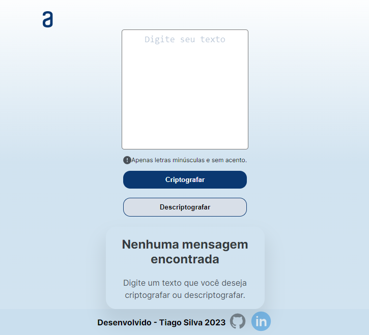

# 
 Decodificador de texto - Challenge One 

  Desafio proposto pela ONE (Oracle Next Education) em conjunto com o Alura.  
  O projeto consiste em criptografar e descriptografar textos utilizando um conjunto de chave.
 
 ## Ferramentas Utilizadas
 * HTML
 * CSS
 * JavaScript
 * Figma ( Nele tinha o Protótipo do projeto )
 * Trello ( Ajudou no auxílio para acompanhar o desenvolvimento da aplicação ) 
 
 ## Link do projeto
<a href="https://tiagobsb84.github.io/Desafio-aplicacao-Modificador_Texto/" target="_blank">Decodificador de Texto</a>

# Imagens do projeto
## Versão Desktop

## Versão mobile

# Contato

  
     

